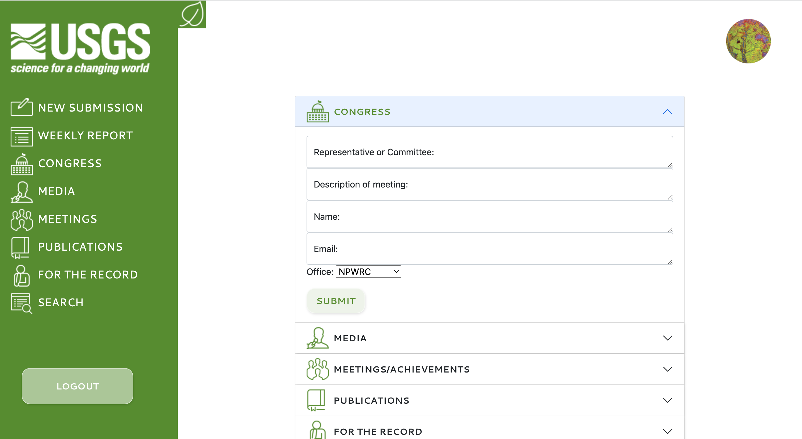
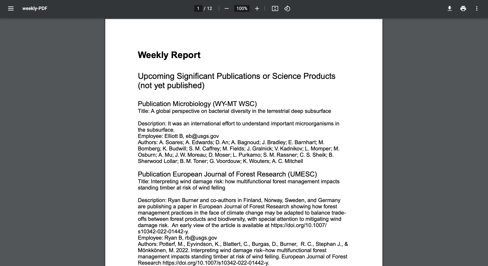

# Accretion

## Table of Contents
[Description](#description)

[Installation](#installation)

[Usage](#usage)

[Screenshots](#screenshots)

[Credits](#credits)

[Dependencies and Libraries](#dependencies/libraries)

[Questions](#questions)

[Future Development](#future-development)

---
 

## Description
We were asked by an employee of the the United States Geological Survey (USGS) to design an app that would allow him to conduct weekly surveys of his region (which are currently being done via email and Microsoft Word) easily and more efficiently. Accretion is the web app we designed to this end. It was designed to be filled out by a single point of contact from each office and submitted weekly. From there the regional coordinators can compile the data and use them effectively.
                
---  
 

## Installation
* Git Bash/Terminal (requires node.js)

        git clone git@github.com:DanielMrva/accretion.git
        npm i

* MySQL

        SOURCE ./db/schema.sql

    If running locally: 

        USE accretion_db
        exit

* Rename .env.EXAMPLE to .env and insert your username and password for MySQL in DB_PASSWORD and DB_USER if running locally.

* Git Bash/Terminal

        npm start

* In your web browser navigate to your root (if running locally it will be at localhost:3001 or whatever port you choose). 

    
---
 
## Usage
From the root url, you may either login or create a new account. If you are a returning user, login using your credentials. If new, create an account. You will then be taken to the dashboard where you can submit new data or compile the weekly report. When submit is selected you are taken to a form page where you may submit your data (note, all fields must be filled in for the data to post to the database). Once a form is filled out you may press the associated submit button to send that data to the database. If you wish to compile the weekly report (from the dashboard) press the weekly report button and all entries from all users from the past 7 days will be displayed. There is a button to print the report to a pdf as well (simply press it and the pdf will generate). In addition to the dashboard, there is a navigation side bar that allows you to submit data, generate the weekly report, and also search for specific data for each of the tables. 

 

Front Page

 

Login Page

 

User Dashboard

 

Input Form

 

Generated weekly report

 

PDF generated report

---
 

## Credits
* **Alfred Garraffa** 
    
    email: agarraffa@gmail.com

    github: https://github.com/agarraffa

* **AmberZimmerman** 

    email: ajz1221@gmail.com

    github: https://github.com/AmberZimmerman

* **Daniel Mrva** 

    email: Mrva.develops@gmail.com
        
    github: https://github.com/DanielMrva

* **Lindsey Choi** 

    email: Lindsey.e.choi@gmail.com
        
    github: https://github.com/lindseychoi

---
 

## Dependencies/Libraries
- Bootstrap
- bcrypt
- blob-stream
- brfs
- sequelize
- express
- handlebars
- MySQL
- pdfkit
- yarn
- node.js
- esling
- prettier

---
 

## Future Development
- Customizable search fields
- Search by office
- Edit/delete functionality
- Improve PDF style and formatting

---     
this file was created usings Alfred Garraffa's Readme generator
